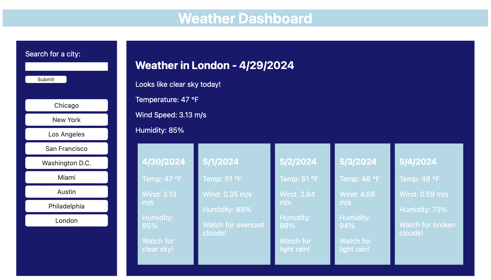

## Weather Dashboard - README

**Table of Contents**

* [Project Description](#description)
* [Summary](#summary)
* [Deployment Instructions](#deployment)
* [Credits](#credits)

****

 

**Project Description **

This weather dashboard application allows users to search for weather information in a specified city. It utilizes the OpenWeatherMap API to retrieve weather data and displays it in a user-friendly interface. The dashboard features the following functionalities:

* **Search Functionality:** Users can enter a city name in the search bar and submit it to retrieve weather data for that location.
* **City History:** Searched cities are stored in local storage and displayed as buttons under the "History" section. Clicking on a city button will re-render the dashboard with the corresponding weather information.
* **Weather Display:** The retrieved weather data is displayed in a well-structured format, including the city name, date, temperature, wind speed, humidity, and a short description of the weather conditions.
* **Five-Day Forecast:** A basic placeholder for a five-day forecast is included, however, the implementation for fetching and displaying detailed forecast data is not included in this version.

**Summary**

This weather dashboard is a basic weather application built with HTML, CSS, and JavaScript. It leverages the OpenWeatherMap API to provide users with current weather information for their desired locations. The application offers functionalities for search, city history, and basic weather data display. Further development is required to implement the five-day forecast feature.

**Deployment Instructions**

1. **Clone the repository:**  If you obtained the code through a version control system like Git, clone the repository to your local machine.
2. **Set up an API key:**  Obtain an API key from OpenWeatherMap (https://openweathermap.org/api) and replace the placeholder value (`526e004ee12b1a0053e1fd9487c7d999`) for `API_KEY` in the `script.js` file.
3. **Run the application:**  Open the `index.html` file in your web browser to launch the weather dashboard application.

**Credits**

* OpenWeatherMap (https://openweathermap.org/api) for providing the weather data API.
* jQuery library (https://jquery.com/) for DOM manipulation and event handling.

This README provides a comprehensive overview of the weather dashboard project. Feel free to customize the styling and functionalities to enhance the application further.

**Danny Kramer (dannylkramer@icloud.com) |**
**Northwestern Coding Bootcamp |**
**Module 6 Homework**